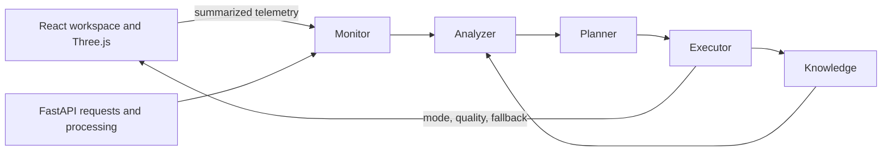

# Day 4 MAPE-K adaptation architecture

ResilioSpace uses a small, deterministic MAPE-K loop. It observes ordinary application execution; it does not generate random metrics or synthetic load.

## Responsibilities

- `monitor.py` collects reconstruction confidence, processing duration/health, rolling API latency, request/error counts, renderer FPS/frame time/health, autosave health, and snapshot-corruption reports.
- `analyzer.py` converts an observation into one explicit condition. Failure conditions take priority over performance conditions.
- `planner.py` maps each condition to an explainable strategy and target mode.
- `executor.py` applies mode/recovery state and records the decision. Renderer actions are returned through the system API and applied by React/Three.js.
- `knowledge.py` owns policies, current mode, active condition/strategy, recovery progress, bounded history, and reusable snapshot validation.
- `policies.py` contains configurable thresholds. `models.py` contains modes, conditions, strategies, observations, and records.

## Modes and actions

| Mode | Meaning | Observable behavior |
|---|---|---|
| `NORMAL` | Observed signals are healthy | Normal device pixel ratio and renderer shadows |
| `PERFORMANCE` | Rendering is overloaded | Pixel ratio is capped at 1; shadow rendering and large shadow maps are disabled |
| `DEGRADED` | A component failed or a result needs intervention | Renderer failure unmounts 3D and opens the 2D reconstruction; low-confidence results request manual review |
| `RECOVERY` | Trigger disappeared, stability not yet proven | Reduced renderer quality remains active while consecutive healthy telemetry is counted |

Planner mappings include renderer overload → `REDUCE_RENDER_QUALITY`, renderer failure → `USE_2D_FALLBACK`, first low-confidence result → `RETRY_ENHANCED_PREPROCESSING`, persistent low confidence → `REQUEST_USER_CORRECTION`, processing failure → `RETRY_PROCESSING`, and corrupt session state → `RESTORE_LAST_VALID_SNAPSHOT`.

## Default thresholds

- reconstruction confidence: minimum `0.55`
- renderer FPS: minimum `24`
- frame time: maximum `45 ms`
- average recent API latency: maximum `1500 ms`
- API error rate: maximum `20%`, evaluated after at least 5 requests
- recovery stability: 3 consecutive healthy observations
- enhanced preprocessing: at most 1 automatic retry
- adaptation history: 50 records
- working snapshots: 3 records per plan

These conservative renderer thresholds are intended to keep ordinary desktop use in `NORMAL`. The frontend aggregates frames for three seconds before sending one summary; it never sends per-frame requests.

## Explainability and APIs

Every recorded event contains UTC timestamp, condition, observed metrics, threshold/trigger, previous mode, strategy, new mode, outcome, optional post-adaptation metrics, and explanation. Post-adaptation metrics remain null until measured.

- `GET /api/system/health`
- `GET /api/system/metrics`
- `GET /api/system/mode`
- `GET /api/system/adaptations`
- `POST /api/system/telemetry`

Metrics are process-local and reset with the backend. Day 4 does not include Prometheus, distributed coordination, or harmful fault injection.
